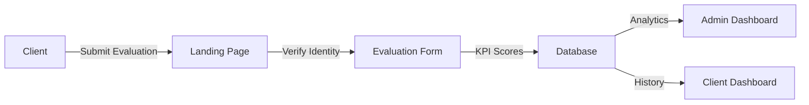

# Spade Security Services - KPI Evaluation System

<p align="center">
  
</p>

<p align="center">
  <strong>A comprehensive performance evaluation and management platform for security personnel</strong>
</p>

---

## Table of Contents

1. [Executive Summary](#executive-summary)
2. [System Overview](#system-overview)
3. [Technology Stack](#technology-stack)
4. [Architecture](#architecture)
5. [Features & Functionalities](#features--functionalities)
6. [User Roles & Access](#user-roles--access)
7. [Getting Started](#getting-started)
8. [API & Database Schema](#api--database-schema)
9. [Free Tier Limitations](#free-tier-limitations)
10. [Security Considerations](#security-considerations)
11. [Deployment](#deployment)
12. [Support & Maintenance](#support--maintenance)

---

## Executive Summary

The **Spade KPI Evaluation System** is a modern web-based platform designed to streamline the performance evaluation process for security guard personnel deployed across various client sites. The system enables clients to submit structured evaluations of guards based on 10 key performance indicators (KPIs), while providing administrators with comprehensive dashboards for monitoring, analysis, and personnel management.

### Key Objectives

- **Standardize Evaluations**: Provide a consistent framework for assessing guard performance
- **Real-time Monitoring**: Enable administrators to track performance metrics in real-time
- **Data-Driven Decisions**: Support personnel decisions with objective performance data
- **Client Transparency**: Allow clients to view and manage their evaluation history

---

## System Overview

### How It Works



1. **Client Access**: Clients access the system via the landing page and verify their identity using their Client ID or Company Name
2. **Guard Selection**: Clients search for the guard they wish to evaluate from the registered guards database
3. **Evaluation Submission**: Clients complete a comprehensive evaluation form scoring 10 KPI categories
4. **Password Verification**: Submissions require password authentication to ensure accountability
5. **Data Processing**: Evaluations are stored and processed for analytics and reporting
6. **Dashboard Access**: Both clients and administrators access their respective dashboards via the unified sign-in page

---

## Technology Stack

### Frontend

| Technology | Version | Purpose |
|------------|---------|---------|
| **React** | 18.x | Core UI framework with component-based architecture |
| **TypeScript** | 5.x | Type-safe JavaScript for improved developer experience |
| **Vite** | 5.4.x | Next-generation frontend build tool for fast development |
| **Tailwind CSS** | 3.x (CDN) | Utility-first CSS framework for rapid UI development |
| **Lucide React** | Latest | Modern icon library for consistent iconography |
| **Recharts** | Latest | Composable charting library for data visualization |

### Backend & Database

| Technology | Plan | Purpose |
|------------|------|---------|
| **Appwrite Cloud** | Free Tier | Backend-as-a-Service (BaaS) platform |
| **Appwrite Auth** | Free Tier | User authentication and session management |
| **Appwrite Databases** | Free Tier | NoSQL document database for data storage |

### Development Tools

| Tool | Purpose |
|------|---------|
| **Node.js** | JavaScript runtime environment |
| **npm** | Package manager for dependencies |
| **ESLint** | Code linting and quality enforcement |
| **Git** | Version control system |

---

## Architecture

### Project Structure

```
spade-performance-hub/
├── public/                     # Static assets
├── scripts/
│   ├── setup-db.js            # Database initialization script
│   └── seed-data.js           # Sample data seeding script
├── src/
│   ├── components/
│   │   ├── admin/             # Admin-specific components
│   │   │   ├── GuardsList.tsx
│   │   │   ├── ClientsList.tsx
│   │   │   └── GuardProfile.tsx
│   │   ├── forms/             # Form components
│   │   │   ├── EvaluationForm.tsx
│   │   │   └── GuardSearch.tsx
│   │   └── ui/                # Reusable UI components
│   │       ├── Button.tsx
│   │       ├── Card.tsx
│   │       ├── Input.tsx
│   │       └── NotificationModal.tsx
│   ├── lib/
│   │   ├── appwrite.ts        # Appwrite client configuration
│   │   └── auth.tsx           # Authentication context provider
│   ├── pages/
│   │   ├── AdminDashboard.tsx # Administrator dashboard
│   │   ├── ClientDashboard.tsx# Client evaluation history
│   │   ├── LandingPage.tsx    # Public landing/evaluation page
│   │   └── SignIn.tsx         # Unified authentication page
│   ├── App.tsx                # Main application component
│   └── index.tsx              # Application entry point
├── .env                       # Environment variables (not committed)
├── package.json               # Project dependencies
├── tsconfig.json              # TypeScript configuration
└── vite.config.ts             # Vite build configuration
```

### Database Schema

The system uses Appwrite's document database with the following collections:

#### Database: `PerfDB`

**Collection: `clients`**
| Field | Type | Description |
|-------|------|-------------|
| `$id` | string | Auto-generated document ID |
| `clientId` | string | Unique client identifier (e.g., "SS-001-A") |
| `name` | string | Company/Client name |
| `password` | string | Client authentication password |
| `createdAt` | datetime | Account creation timestamp |

**Collection: `guards`**
| Field | Type | Description |
|-------|------|-------------|
| `$id` | string | Auto-generated document ID |
| `guardId` | string | Unique guard identifier (e.g., "G-2024-001") |
| `name` | string | Full name of the guard |
| `createdAt` | datetime | Registration timestamp |

**Collection: `evaluations`**
| Field | Type | Description |
|-------|------|-------------|
| `$id` | string | Auto-generated document ID |
| `clientId` | string | Reference to evaluating client |
| `guardId` | string | Reference to evaluated guard |
| `guardName` | string | Denormalized guard name |
| `kpi_scores` | string | JSON string of KPI category scores |
| `totalScore` | integer | Calculated total score (0-100) |
| `createdAt` | datetime | Evaluation submission timestamp |

---

## Features & Functionalities

### 1. Landing Page - Client Evaluation Portal

**Purpose**: Enable clients to submit guard performance evaluations

**Features**:
- Client identity verification (by ID or Company Name)
- Guard search with autocomplete functionality
- Comprehensive 10-category KPI evaluation form
- Password-protected submission
- Success/Error notification modals

**KPI Categories Evaluated**:
1. Appearance & Grooming
2. Punctuality & Attendance
3. Alertness & Vigilance
4. Communication Skills
5. Attitude & Professionalism
6. Knowledge of Duties
7. Report Writing
8. Emergency Response
9. Customer Service
10. Overall Performance

### 2. Unified Sign-In Page

**Purpose**: Single authentication entry point for all user types

**Features**:
- **Admin Login**: Appwrite Auth-based authentication
- **Client Login**: Database credential verification
- Intelligent routing based on user type
- Admin ID shortcut mapping ("admin" → email)
- Rate limit detection and user feedback
- Session management with conflict resolution

### 3. Client Dashboard

**Purpose**: Enable clients to view and manage their evaluation history

**Features**:
- Comprehensive evaluation history table
- 10-column KPI breakdown view
- Total score with color-coded grading
- Automated remarks (Maintain/Warning/Terminate)
- 12-hour edit window for recent evaluations
- Profile menu with password management
- Secure sign-out functionality

**Grading System**:
| Score Range | Grade | Action |
|-------------|-------|--------|
| 90-100% | Excellent | Maintain |
| 70-89% | Good | Maintain |
| 50-69% | Satisfactory | Warning |
| Below 50% | Poor | Terminate |

### 4. Admin Dashboard

**Purpose**: Comprehensive administrative overview and management

**Features**:

#### Dashboard Overview
- **KPI Cards**: Active Guards, Active Clients, Average Overall Score
- **Monthly Activity Trends**: Visual chart showing guard/client growth
- **Status Monitoring**: Terminated guards and deactivated clients tracking
- **Top Performers**: Leaderboard of highest-rated guards

#### Guards Management
- Complete guards master list
- Add new guard functionality
- Real-time search and filtering
- Guard profile pages with evaluation history
- Performance statistics per guard
- Delete guard capability

#### Clients Management
- Complete clients master list
- Add new client with secure password
- Real-time search and filtering
- Account management capabilities

---

## User Roles & Access

### Role: Client

**Access Level**: Client Dashboard + Evaluation Submission

| Permission | Description |
|------------|-------------|
| Submit Evaluations | Create new guard evaluations |
| View History | Access personal evaluation history |
| Edit Recent | Modify evaluations within 12 hours |
| Change Password | Update account password |

### Role: Administrator

**Access Level**: Full System Access

| Permission | Description |
|------------|-------------|
| View Dashboard | Access analytics and overview |
| Manage Guards | Create, view, delete guards |
| Manage Clients | Create, view, delete clients |
| View All Evaluations | Access system-wide evaluation data |
| View Guard Profiles | Detailed guard performance analysis |

---

## Getting Started

### Prerequisites

- Node.js 18.x or higher
- npm 9.x or higher
- Appwrite Cloud account (free tier available)

### Installation

1. **Clone the repository**
   ```bash
   git clone https://github.com/your-repo/spade-performance-hub.git
   cd spade-performance-hub
   ```

2. **Install dependencies**
   ```bash
   npm install
   ```

3. **Configure environment variables**
   
   Create a `.env` file in the project root:
   ```env
   VITE_APPWRITE_PROJECT_ID=your_project_id
   VITE_APPWRITE_ENDPOINT=https://cloud.appwrite.io/v1
   APPWRITE_API_KEY=your_api_key
   ```

4. **Initialize the database**
   ```bash
   node scripts/setup-db.js
   ```

5. **Seed sample data** (optional)
   ```bash
   node scripts/seed-data.js
   ```

6. **Start development server**
   ```bash
   npm run dev
   ```

7. **Build for production**
   ```bash
   npm run build
   ```

### Default Credentials

| Role | Identifier | Password |
|------|------------|----------|
| Admin | `admin` or `john@spadesecurityservices.com` | (Set in Appwrite Console) |
| Client | Client ID or Company Name | (Set during client creation) |

---

## Free Tier Limitations

The system is designed to operate within **Appwrite Cloud Free Tier** limits:

### Appwrite Free Tier Specifications

| Resource | Limit | Current Usage |
|----------|-------|---------------|
| **Bandwidth** | 10GB/month | Variable |
| **Storage** | 2GB | Minimal (text data only) |
| **Database Documents** | 500,000 | ~3 collections |
| **Monthly Executions** | 750,000 | Auth + CRUD operations |
| **API Requests** | Unlimited* | Subject to rate limits |
| **Users** | 75,000 | Admin + Clients |
| **Teams** | Unlimited | Not used |

### Rate Limiting

Appwrite enforces rate limits to prevent abuse:
- **Login Attempts**: ~10 per minute per IP
- **API Requests**: ~100 per minute per endpoint
- **Cooldown Period**: 5-10 minutes after exceeding limits

### Scaling Considerations

For production deployments exceeding free tier limits:
- Upgrade to Appwrite Pro ($15/month) for increased limits
- Consider self-hosted Appwrite for full control
- Implement caching strategies to reduce API calls

---

## Security Considerations

### Authentication

- **Admin Users**: Appwrite Auth with email/password
- **Client Users**: Database-stored credentials (hashed recommended for production)
- **Session Management**: Appwrite handles session tokens

### Data Protection

- All API communications use HTTPS/TLS encryption
- Appwrite provides built-in security headers
- Cross-Origin Resource Sharing (CORS) configured per project

### Production Recommendations

1. **Password Hashing**: Implement bcrypt for client passwords
2. **Input Validation**: Add server-side validation rules
3. **Rate Limiting**: Configure custom rate limits in Appwrite
4. **Audit Logging**: Enable Appwrite audit logs
5. **Backup Strategy**: Configure automated database backups

---

## Deployment

### Recommended Platforms

| Platform | Type | Free Tier |
|----------|------|-----------|
| **Vercel** | Static Hosting | Yes |
| **Netlify** | Static Hosting | Yes |
| **Cloudflare Pages** | Static Hosting | Yes |
| **GitHub Pages** | Static Hosting | Yes |

### Deployment Steps (Vercel)

1. Connect GitHub repository to Vercel
2. Configure build settings:
   - Build Command: `npm run build`
   - Output Directory: `dist`
3. Add environment variables in Vercel dashboard
4. Deploy

### Environment Variables Required

```env
VITE_APPWRITE_PROJECT_ID=your_project_id
VITE_APPWRITE_ENDPOINT=https://cloud.appwrite.io/v1
```

> **Note**: `APPWRITE_API_KEY` is only needed for server-side scripts, not for the frontend deployment.

---

## Support & Maintenance

### Version History

| Version | Date | Description |
|---------|------|-------------|
| 1.0.0 | December 2024 | Initial release with core features |

### Known Issues

1. Rate limiting may trigger after multiple failed login attempts
2. Large evaluation datasets may require pagination (future enhancement)

### Future Enhancements

- [ ] PDF report generation for guard profiles
- [ ] Email notifications for new evaluations
- [ ] Mobile-responsive optimizations
- [ ] Bulk data import/export functionality
- [ ] Advanced analytics and trend analysis
- [ ] Multi-language support

### Contact

For support and inquiries:
- **Website**: [spadesecurityservices.com](https://spadesecurityservices.com)
- **Technical Issues**: Create an issue in the GitHub repository

---

## License

This project is proprietary software developed for Spade Security Services. All rights reserved.

---

<p align="center">
  <strong>Spade Security Services</strong><br>
  <em>"Professional Security Solutions"</em>
</p>
